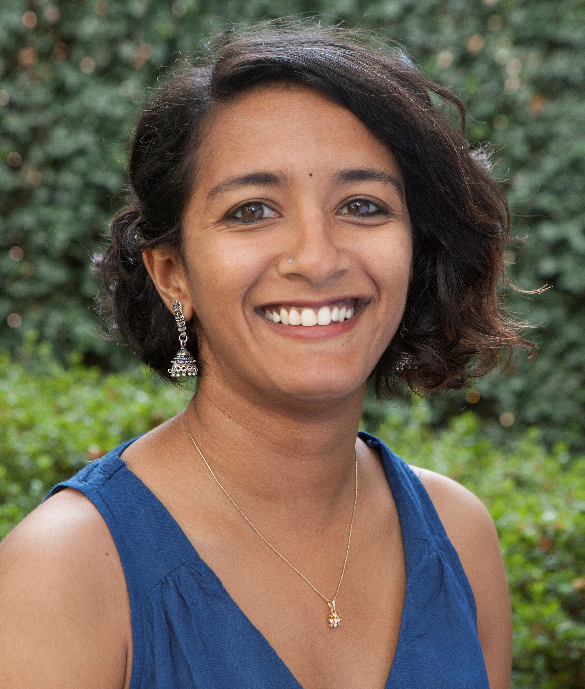
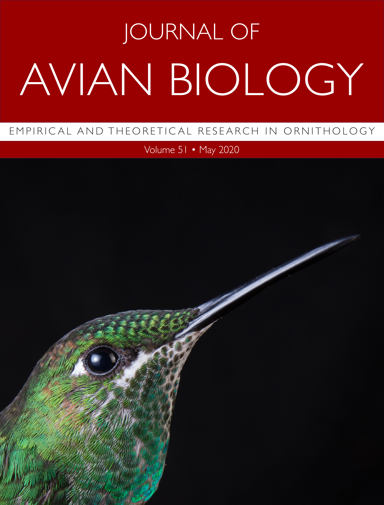

<style>
body {
text-align: justify}
</style>

``` {r echo=FALSE, fig.cap = "© Jen Shook/National Geographic", out.width="30%", out.extra='style="float:left; padding:10px"'}

```

I am a [National Geographic](https://www.nationalgeographic.org/find-explorers/anusha-shankar) Explorer and Young Leader, a Lewis and Clark [Field Scholar](https://www.amphilsoc.org/grants/lewis-and-clark-fund-exploration-and-field-research), and am currently a  [Rose Postdoctoral Fellow](https://www.birds.cornell.edu/home/current-postdoctoral-fellows/), studying hummingbirds, with [Dr. Irby Lovette](https://ecologyandevolution.cornell.edu/irby-lovette) and [Dr. Maren Vitousek](https://ecologyandevolution.cornell.edu/maren-vitousek) at the Lab of Ornithology at Cornell University. Until August 2020, I was a Postdoctoral Fellow with [Dr. Cory Williams](http://www.corytwilliams.com/) at the University of Alaska at Fairbanks, where I studied seasonal depression (Seasonal Affective Disorder) in Nile grass rats. I graduated with a PhD in December 2018 from the department of Ecology and Evolution at Stony Brook University, New York where I worked with [Dr. Catherine Graham](https://www.wsl.ch/en/employees/graham.html) and [Dr. Don Powers](http://www.dpowerslab.com/) from George Fox University, studying how hummingbirds budget their energy across a number of sites in Arizona and Ecuador. And before that, I got a Master's from Pondicherry University, India, studying nesting hornbills in the Western Ghats, and a Bachelor's in Zoology and Biotech from Stella Maris College, Chennai, India. I am broadly interested in how animals manage their energetic needs. I love giving talks and communicating science, especially to the public (but also to scientists)! Have a talk idea or request? [Contact me!](mailto:anusha.shankar@cornell.edu)


Hummingbirds are incredible animals, with among the highest metabolic rates of all vertebrates. What energetic strategies do they use to survive? How do they allocate their limited energy budgets to different activities? Read [my blog page](https://anushashankar.weebly.com/blog/what-am-i-doing-in-ecuador-and-photos) to see how I went about answering these questions!

My interests include: whole-animal physiology, ecology, respirometry, field physiology, doubly labeled water, behavioural ecology, birds, reptiles, coding in R, managing data, producing graphics/videos for the public, photography, grant-writing (love it), giving talks, teaching, and mentoring.

<center>
#### 1.5-minute 'Today I Learned' video about hummingbirds:
<iframe width="560" height="315" src="https://www.youtube.com/embed/yKytMZ8G4gA" frameborder="0" allowfullscreen></iframe>
</center>
<br />

**What I want to be when I grow up**: I have a PhD now, and I don't think I will/should ever stop searching for the answer to this question. But- I want to bring people together to solve big problems in animal ecology and conservation, especially in the tropics. Science is my way of making sense of my world using observation and logic, and I would like to share my passion for science with the world. I saw my PhD as one (long-ish) step on a path to learning the tools, methods, teaching and outreach skills to do science and share it with people of all kinds. Getting a peek into organizations like WWF and National Geographic has convinced me that there are many great people creating hope in this sometimes-bleak world. And the key to unleashing this hope is opening people's minds. Turning skeptics of science, slowly and steadily, into believers, involving local communities in conservation, and most importantly, growing children to be observers, doers, and scientists - no matter what profession they choose. People seem most influenced by a few key people in their past- we as scientists need to get better at being those key influencers.

I have a great interest in **science communication**- I think it is a shame for so much fascinating science to sit on dusty library shelves or in dusty internet blackholes. Here are some of the initiatives I am a part of, to either facilitate scientists being more transparent communicators, or to try being a better communicator myself:
National Geographic Society - see the videos on the (outreach/videos)[https://anushashankar.weebly.com/outreachvideos.html] page and a [blog article](http://blog.nationalgeographic.org/2018/02/06/why-i-am-obsessed-with-hummingbird-pee-and-torpor/) on my research;
[BrainChem (& Ecology)](https://www.facebook.com/brainchem/), a popular science site I run with Chemical Neurobiologist [Pratik Kumar](http://pratikkumar15.wixsite.com/pratik); 
[Science Outside](https://scienceoutside.com/), a website featuring fun stories from field scientists;
[Crowd-funded project](https://experiment.com/projects/a-mother-s-work-is-never-done-using-thermal-imaging-to-detect-torpor-in-nesting-hummingbirds/dashboard/metrics) on nesting hummingbirds that I am working on with Erich Eberts- a past student of mine- and other collaborators;
Crowd-funded [project](https://experiment.com/projects/do-hummingbirds-actually-sleep) titled "Do hummingbirds actually sleep" with [Dr. Don Powers](http://www.dpowerslab.com/) and students

<div align="center" style="position:fixed">

#### We were on the cover of the May 2020 edition of the Journal of Avian Biology!
##### For our paper on hummingbird torpor.
Cover image of a green-crowned brilliant: Sean Graesser ([gourmetbiologist](https://www.instagram.com/gourmetbiologist/?hl=en))

<center>
{width="30%"}


<center>
### News
</center>

</div>
<style>
body {
text-align: justify}
</style>

* Just started as a Rose Postdoctoral Fellow with the Lab of Ornithology at Cornell University, Ithaca, NY, August, 2020!

* Our latest paper made it to the cover of Journal of Avian Biology! It's about hummingbird torpor under natural conditions, May, 2020!

* I wrote a children's book, and it just got published on Storyweaver, April 2020!

* Paper just out in Journal of Animal Ecology on hummingbird energy allometries, using a new energy budget approach, February, 2020!

* I just accepted an offer to start a Rose Postdoctoral Fellowship at the Lab of Ornithology at Cornell University in August 2020!

* Paper out in Functional Ecology on hummingbird daily energy budgets, August, 2019!

* Gave a TEDx talk on hummingbirds and time management in my hometown, Chennai, Mar, 2019! What an amazing experience.

* Now in Fairbanks, Alaska for the next year and a half, Jan, 2019!

* PhD defense passed, Nov 26, 2018!

* Just back from National Geographic Explorer's Festival in DC, Jun 2018

* Wrapped up three weeks' fieldwork thermal imaging hummingbirds at night in Arizona. Jun 2018

* Gave an invited talk at the Telluride Mountainfilm Festival! May 2018

* Interview for the Audubon just came out! Apr 2018

* My blog post on National Geographic, about my hummingbird research is out! Feb 2018

* Excited to be a part of the first batch of National Geographic's Leadership and Development program, Aug 2017

* Anita Morales, ex-head field assistant is now a Master's student at McGill University, Aug 2017

* Erich Eberts , ex-field assistant, is now a Master's student at the University of Toronto Scarborough with Dr. Ken Welch

* More fieldwork, funded by a David Ludwig travel scholarship from AEHS!

* In Arizona with Don's lab taking some really exciting IR and metabolism measurements , June 2017

* Received the Distinguished Travel Award from Stony Brook's Graduate Student Organization to attend a physiology conference in Rio de Janeiro, Brazil, May 2017

* Gaby Urgiles and Gaby Cordova, Bachelor's theses on my project, received the prestigious IV National Ecuadorian Awards: Contest of Appreciation awards, from the SENESCYT- Ecuador's Ministry of Higher Education, Dec 2016

* My video on hummingbirds is up on the Nat Geo Today I Learned website, Oct 2016

* Just got news that I am now a Lewis and Clark Field Scholar, May 2016

* Awarded the University's Mildred and Herbert Weisinger Dissertation Fellowship , Mar 2016
<br />
<center>
##### Contact: Anusha Shankar  |  Twitter: [\@nushiamme](https://twitter.com/nushiamme)  |  Email: [anusha.shankar@cornell.edu](mailto:anusha.shankar@cornell.edu) 
</center>

<div class="tocify-extend-page" data-unique="tocify-extend-page" style="height: 0;"></div>
