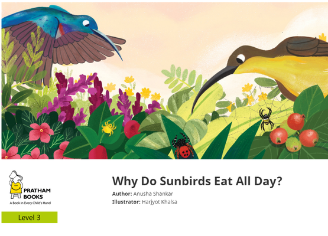
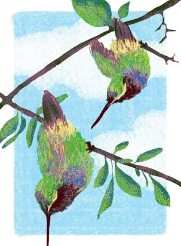
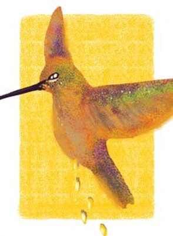
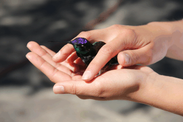
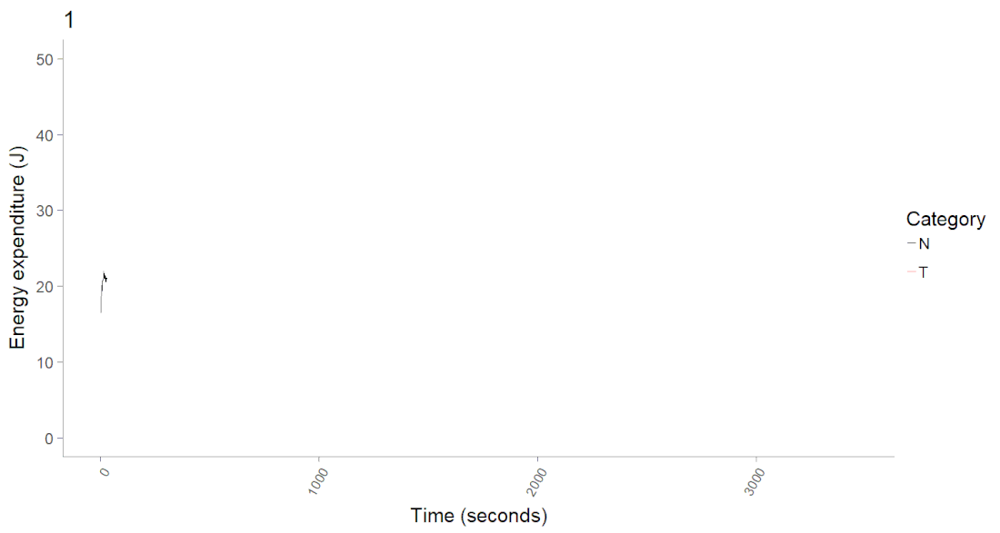
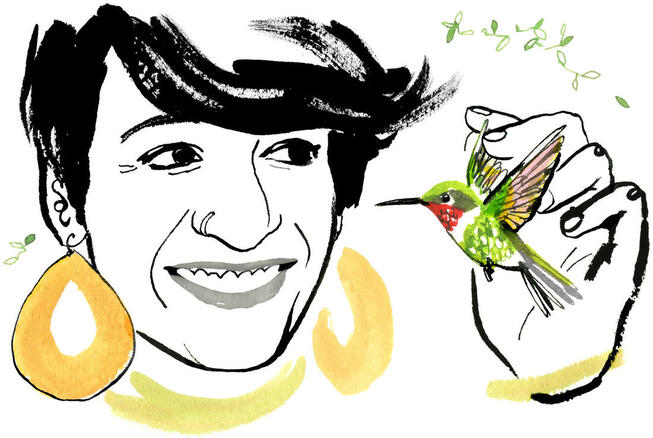
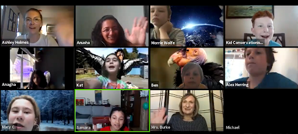
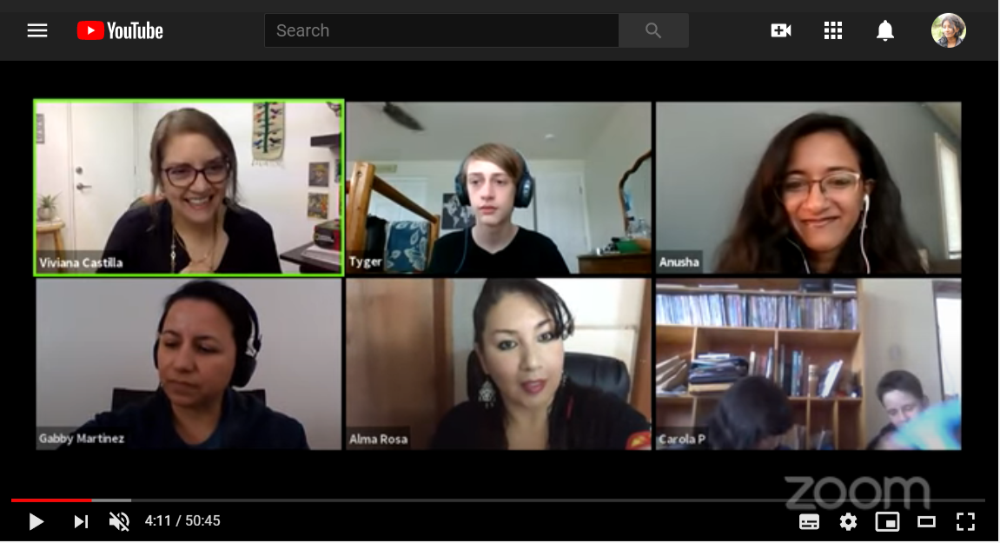

## Science outreach and communication
Here are a few science communication and crowd-funded projects I am involved with:   
[BrainChem (& Ecology)](https://www.facebook.com/brainchem/), a popular science site I run with a Chemical Neurobiologist, [Pratik Kumar](http://pratikkumar15.wixsite.com/pratik).   
[Science Outside](https://scienceoutside.com/), a website featuring fun stories from field scientists - submit your stories to us!   
[Crowd-funded project](https://experiment.com/projects/a-mother-s-work-is-never-done-using-thermal-imaging-to-detect-torpor-in-nesting-hummingbirds/dashboard/metrics) on nesting hummingbirds that I am working on with [Erich Eberts](https://ebertser.wordpress.com/author/ebertser/) - a past mentee/current collaborator of mine- and other collaborators.   
Crowd-funded [project](https://experiment.com/projects/do-hummingbirds-actually-sleep) titled "Do hummingbirds actually sleep" I worked on with Dr. Don Powers and students.   

Check out [Open Explorer](https://openexplorer.nationalgeographic.com/home), an open National Geographic platform for scientists to post field notes and engage with the public.   

Below are snapshots of my writing and videos for the public!       

### I wrote a children's book for Pratham's Storyweaver

{width="70%"}

### Here are three articles I wrote for Current Conservation   

{width="30%"}  |  {width="30%"}  |  {width="30%"}

[A city-girl field ecologist](http://currentconservation.org/issues/a-city-girl-field-ecologist/) | [Fun hummingbird facts](https://www.currentconservation.org/cc-kids/fun-facts-2/)  | [A day in the life of: Anusha Shankar](https://www.currentconservation.org/cc-kids/humming-with-energy/) 

### Blog article for National Geographic / Science Outside

I wrote a blog article about hummingbird torpor and why I love collecting their pee, which used to be hosted on National Geographic's (now defunct) blog. You can find it on [Science Outside](https://scienceoutside.com/portfolio/my-two-recent-obsessions-have-been-hummingbird-pee-and-torpor/).   

{width=25%}  {width=70%}

### Here's an [article in the Audubon](http://www.audubon.org/news/why-anusha-shankar-doesnt-mind-being-hummingbird-pee-person) about my research!

{width=70%}

### Publicly available videos

**Oct 11, 2020 OutsideIn series from the Bangalore Life Science Cluster (BLiSC),**  
National Centre for Biological Sciences, Bangalore, India  
*From hornbills to hummingbirds: What watching wildlife can teach us about ourselves*  

**Aug 14, 2020 'True Facts' video by Ze Frank that collaborator Don Powers and I contributed to**!

**June 26, 2020 Madras Naturalists' Society**  
*How do the world's smallest birds - hummingbirds - manage to exist?*

**June 25, 2020 British Ecological Society's Ecology Live series**  
*Spending energy unusually and flexibly: Lessons from flying ninja hummingbirds*  

**May 28, 2020 National Geographic Explorer Classroom hangout**  
*Seeing Science in Everyday Life with Anusha Shankar*  

**May 11, 2020 National Geographic Explorer Classroom hangout in Spanish**  
*La vida secreta de los colibríes con Anusha Shankar*

 
**June 28, 2019 Two American Ornithological Society videos**  
[here](https://www.facebook.com/421243554746287/videos/2399312180127268/) and [here](https://www.facebook.com/421243554746287/videos/412831486111338) on Diversity in ornithology

**March 10, 2019 TEDx talk in my dear hometown of Chennai, India**  
*What can hummingbirds teach us about time?*

**Feb 22, 2019 National Geographic Explorer Classroom hangout**  
*Hummingbirds wet their beds, and other field curiosities*

**Apr 25, 2018 Stony Brook University 3 Minute Thesis**  
*The surprising secrets of sleeping hummingbirds*

**Oct 21, 2016 Today I Learned, National Geographic**  
*Hummingbirds can starve to death in hours*

 

##### Contact: Anusha Shankar  |  Twitter: [\@nushiamme](https://twitter.com/nushiamme)  |  Email: [anusha.shankar@cornell.edu](mailto:anusha.shankar@cornell.edu) 

